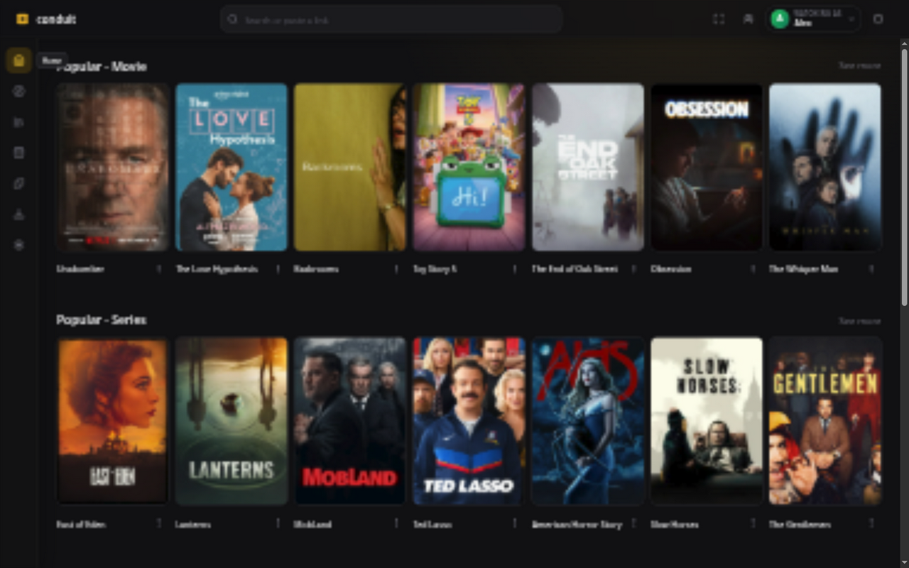

# Conduit

A self-hosted film and television app built around Stremio-compatible add-ons.
Share household profiles, libraries, and watch progress across your devices.
Clients fetch catalogs and media directly from add-ons and sources.

[Install](docs/installation.md) · [Self-host](docs/deployment.md) ·
[Contribute](CONTRIBUTING.md) · [Ask a question](https://github.com/davidvanderklay/conduit/discussions)



## Platform status

| Client | Current status |
| --- | --- |
| Web | Available. Playback depends on browser codecs and CORS. |
| Windows, macOS, Linux | Available. Electron with native libmpv playback. |
| Android and iOS | Available by sideloading. Release hardening underway. |
| Android TV and Google TV | Very experimental. Uses the Android APK. |
| tvOS | Planned. |

Pre-release software. Keep profile exports and database backups.

## Help build Conduit

Code, documentation, reproducible bug reports, and device testing are welcome.

- Pick a [good first issue](https://github.com/davidvanderklay/conduit/issues?q=is%3Aissue%20is%3Aopen%20label%3A%22good%20first%20issue%22)
  and comment before starting.
- Read the [contribution guide](CONTRIBUTING.md) and [development setup](docs/development.md).
- Use [Discussions](https://github.com/davidvanderklay/conduit/discussions) for questions,
  ideas, and device test results.

## What Conduit does

- Shared household profiles with independent libraries and watch history
- Stremio-compatible catalogs, metadata, streams, and subtitles
- Web and Electron desktop clients backed by one shared interface
- Android and iOS clients with shared Compose UI and native playback
- Very experimental Android TV and Google TV support with remote navigation
- Portable profile import/export
- Local password accounts without an email-delivery dependency
- Google OAuth or administrator-configured OpenID Connect
- Recovery codes and machine-local administrator recovery

## Quick development setup

Prerequisites are provided by the Nix flake:

```sh
nix develop
cp .env.example .env
docker compose -f compose.source.yaml -f compose.dev.yaml up -d postgres
pnpm install
pnpm core:build
pnpm --filter @conduit/updates build
pnpm db:migrate
pnpm dev
```

The web client runs at `http://localhost:5173` and the API server at
`http://localhost:3000`.

See [Development](docs/development.md) for repository structure, individual
commands, tests, database migrations, and desktop requirements.

## Install Conduit

Start with [Installation](docs/installation.md) for Windows, macOS, Linux,
Android, Android TV, and iOS. It explains how to choose Stable or Nightly and
how to update. Release tracks are independent for each component.

### Linux Flatpak

Install the signed Flatpak repository and Conduit for the current user:

```sh
flatpak remote-add --user --if-not-exists conduit \
  https://davidvanderklay.github.io/conduit/conduit.flatpakrepo
flatpak install --user conduit media.conduit.desktop//master
```

Later releases are delivered through the normal `flatpak update` flow. See
[Desktop releases](docs/releases.md#flatpak) for update, removal, and
troubleshooting instructions. A standalone `.flatpak` bundle remains available
on each desktop GitHub release as a fallback.

## Self-hosting with Docker

Download the deployment files into any empty directory. No source checkout or
local image build is required. Replace `YOUR_VERSION` with a published server
component version. Historical combined releases use their shared
`CONDUIT_VERSION` pin; see the migration notes in [deployment docs](docs/deployment.md):

```sh
mkdir conduit && cd conduit
release=server/vYOUR_VERSION
curl -fsSLO "https://github.com/davidvanderklay/conduit/releases/download/${release}/compose.yaml"
curl -fsSLO "https://github.com/davidvanderklay/conduit/releases/download/${release}/.env.docker.example"
cp .env.docker.example .env
# Edit .env and replace every replace-with-* value. Keep its tested
# CONDUIT_SERVER_VERSION and CONDUIT_WEB_VERSION pins.
docker compose up -d
```

Open `http://localhost:8321`. The default first-owner flow requires the private
`CONDUIT_BOOTSTRAP_TOKEN` from `.env`. The default port binds to localhost; set
`CONDUIT_BIND_ADDRESS=0.0.0.0` only when deliberate LAN or router exposure is
wanted. See [Deployment and operations](docs/deployment.md) for reverse proxies,
backups, bootstrap modes, and upgrades.

## Documentation

Read the [documentation site](https://davidvanderklay.github.io/conduit/docs/)
for navigation and search, or browse the Markdown guides below.

- [Installation and Stable/Nightly tracks](docs/installation.md)
- [User and authentication setup](docs/authentication.md)
- [Deployment and operations](docs/deployment.md)
- [Desktop, Android, and iOS releases](docs/releases.md)
- [Updates and track switching](docs/updates.md)
- [Mobile development and release](docs/mobile-development.md)
- [Watch parties](docs/watch-parties.md)
- [Media compatibility](docs/media-compatibility.md)
- [Development guide](docs/development.md)
- [Project roadmap](docs/roadmap.md)
- [Portable profile format](docs/portable-profile-format.md)

## Authentication summary

The first account becomes the instance owner. Local registration closes by
default after that account is created. The owner can configure Google directly
or connect a custom OpenID Connect provider from `/admin`.

Users may link OAuth and disable their local password. Before doing that they
should save recovery codes and verify the OAuth login in a separate browser.
An operator with shell access can restore local login without enumerating users:

```sh
pnpm admin:recover
```

The command prompts for one account email and prints a single-use recovery link
that expires after ten minutes. See [Authentication](docs/authentication.md)
for the complete security and recovery model.

## Data and privacy model

Account identities are separate from household profile names. Conduit does not
request a personal name during local registration. Google login requests only
OpenID and email identity scopes.

Configured add-on URLs are encrypted in PostgreSQL. OAuth client secrets are
also encrypted and OAuth tokens are encrypted by Better Auth. Clients fetch
add-on catalogs, metadata, streams, and subtitles directly; the sync server
does not proxy add-on or media traffic.

Profile exports protect portable user data, while recovery codes protect
account access. They solve different problems, and users should keep both.

## Current direction

The mobile clients now cover server selection, local and OAuth sign-in,
households and profiles, add-on catalogs, search, libraries, watch history,
continue watching, native stream playback, subtitles, and synchronized watch
progress. They also retain an encrypted profile snapshot for limited offline
access to library and history state; media is not downloaded for offline
playback. See
[Mobile development and release](docs/mobile-development.md) for the current
support boundary and packaging path.

Android TV and Google TV now have a very experimental interface in the Android
app. See [TV setup](docs/installation.md#android-tv-and-google-tv) for installation,
phone sign-in, and current limits. The next major product targets are mobile
and TV release hardening; tvOS remains planned. Longer-term work includes
first-class Jellyfin/Plex integration for unified progress and library workflows. See the
detailed [Roadmap](docs/roadmap.md).

Conduit is intentionally not becoming a general reader or media inbox. YouTube,
RSS, audiobooks, and podcast aggregation are outside the current product scope;
the focus remains a cohesive film and television experience.

## License

The repository's server, web, desktop, and other components remain licensed
under the MIT License. See [LICENSE](LICENSE).

The Apple mobile application is distributed under the GNU General Public
License version 3 because its iOS target links MPVKit and its bundled libmpv
media runtime. The app-specific boundary and source-distribution notice are in
[`apps/mobile/iosApp/LICENSE`](apps/mobile/iosApp/LICENSE), with the complete
GPLv3 text in [`apps/mobile/iosApp/LICENSE-GPL-3.0.txt`](apps/mobile/iosApp/LICENSE-GPL-3.0.txt).
See
[third-party notices](THIRD_PARTY_NOTICES.md) for the linked media libraries
and their upstream license files.
